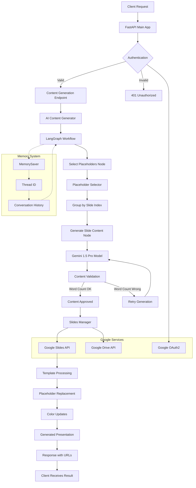

# Technical Documentation: AI Pitchdeck Content Generator

## 1. Technologies and Tools

### Backend Framework
- **FastAPI**: Modern, fast web framework for building APIs with Python 3.11+
- **Uvicorn**: ASGI server for running FastAPI applications
- **Pydantic**: Data validation and settings management using Python type annotations

### AI and Machine Learning
- **Google Generative AI (Gemini)**: Primary AI model for content generation
  - Model: `gemini-1.5-pro` (main model for content generation)
  - Model: `gemini-1.5-flash` (fallback/alternative model)
- **LangChain**: Framework for developing applications with language models
  - `langchain-google-genai`: Google Generative AI integration
  - `langchain-core`: Core LangChain components
- **LangGraph**: Library for building stateful, multi-actor applications with LLMs
  - Used for workflow orchestration and state management
  - Includes memory persistence with `MemorySaver`

### Google Cloud Integration
- **Google Slides API**: For creating and manipulating presentations
- **Google Drive API**: For file management and template access
- **Google OAuth2**: Authentication and authorization
- **Google API Python Client**: Official Google APIs client library

### Authentication & Security
- **Google OAuth2**: Primary authentication method
- **JWT (JSON Web Tokens)**: Token-based authentication using `python-jose`
- **API Key Authentication**: Alternative authentication method
- **CORS Middleware**: Cross-origin resource sharing configuration

### Development & Deployment
- **Docker**: Containerization with multi-stage builds
- **Python 3.11**: Runtime environment
- **Environment Variables**: Configuration management with `python-dotenv`

### Dependencies Overview
```
fastapi                    # Web framework
uvicorn                   # ASGI server
google-auth*              # Google authentication libraries
google-api-python-client  # Google APIs client
langchain*                # LLM framework and integrations
google-generativeai       # Google AI SDK
pydantic                  # Data validation
python-jose               # JWT handling
python-dotenv             # Environment management
```

## 2. AI Models Used

### Primary Model: Google Gemini 1.5 Pro
- **Model ID**: `gemini-1.5-pro`
- **Purpose**: Main content generation for presentation placeholders
- **Capabilities**:
  - Advanced text generation with context awareness
  - Instruction following with precise word count requirements
  - Style and format consistency
  - Multi-turn conversations with memory

### Model Configuration
```python
llm = ChatGoogleGenerativeAI(model="gemini-1.5-pro")
```

### Model Usage Patterns
- **Single-shot Generation**: Initial content creation for placeholders
- **Iterative Refinement**: Word count adjustment and content optimization
- **Context-aware Generation**: Uses conversation history and thread IDs
- **Structured Prompting**: System and human message templates for consistent output

## 3. System Architecture Flow



## 4. Detailed Model Architecture

### 4.1 Workflow State Management

The system uses a **stateful workflow** approach with LangGraph:

```python
class WorkflowState(BaseModel):
    prompt: str                                    # User's business prompt
    placeholders: List[Any]                       # Template placeholders
    placeholder_groups: List[PlaceholderGroup]    # Grouped by slide
    generated_content: Dict[str, str]             # Final content mapping
    errors: List[str]                            # Error tracking
```

### 4.2 Placeholder Processing Model

#### Placeholder Structure
```python
class Placeholder(BaseModel):
    name: str                    # Unique identifier
    instruction: Optional[str]   # Generation instructions
    slide_index: Optional[int]   # Slide position
    element_type: Optional[str]  # UI element type
    min_words: Optional[int]     # Minimum word count
    max_words: Optional[int]     # Maximum word count
```

#### Word Constraint Parsing
- **Pattern Recognition**: `{{min,max}}` format in instructions
- **Constraint Types**:
  - Exact count: `{{30,30}}` → exactly 30 words
  - Range: `{{25,35}}` → between 25-35 words
  - Minimum only: `{{20,}}` → at least 20 words
  - Maximum only: `{{,50}}` → at most 50 words

### 4.3 Content Generation Pipeline

#### Stage 1: Placeholder Selection
```
Input: Raw placeholders from Google Slides
↓
Process: Parse word constraints and instructions
↓
Group: Organize by slide index
↓
Output: Structured PlaceholderGroup objects
```

#### Stage 2: Content Generation
```
For each placeholder:
1. Analyze instruction and example format
2. Determine target word count
3. Generate initial content with Gemini
4. Validate word count (±2 words tolerance)
5. If invalid: Retry with specific adjustment instructions
6. Maximum 3 retry attempts
7. Final validation and truncation if needed
```

#### Stage 3: Quality Assurance
- **Word Count Verification**: Exact counting with space-separation
- **Format Consistency**: Matches provided examples
- **Content Coherence**: Maintains meaning through iterations
- **Error Handling**: Comprehensive error tracking and reporting

### 4.4 Memory and Persistence

#### Thread-based Memory System
```python
# Memory configuration
config = {"configurable": {"thread_id": thread_id}}
memory = MemorySaver()
workflow = workflow.compile(checkpointer=memory)
```

#### Memory Features
- **Conversation Continuity**: Maintains context across requests
- **Thread Isolation**: Separate memory spaces per user session
- **State Persistence**: Workflow state saved between calls
- **Memory Retrieval**: Previous context influences new generations

### 4.5 Google Slides Integration

#### Template Processing
1. **Template Discovery**: Search Google Drive for template files
2. **Placeholder Extraction**: Parse slide comments for instructions
3. **Structure Analysis**: Map placeholders to slide positions
4. **Content Replacement**: Batch update all placeholders
5. **Color Management**: Theme and hex color modifications
6. **Permission Management**: Set appropriate sharing permissions

#### API Integration Points
```python
# Core services
slides_service = build('slides', 'v1', credentials=credentials)
drive_service = build('drive', 'v3', credentials=credentials)

# Key operations
- presentations().get()           # Retrieve presentation structure
- presentations().batchUpdate()   # Apply content changes
- comments().list()              # Extract placeholder instructions
- files().copy()                 # Create new presentations from templates
```

### 4.6 Authentication Architecture

#### Multi-tier Authentication
1. **Application Credentials**: For public template access
2. **User OAuth2**: For personal file operations
3. **API Key**: Alternative authentication method
4. **JWT Tokens**: Session management

#### Credential Flow
```
User Request → OAuth2 Validation → Google API Credentials → Service Access
     ↓
API Key Check → Application Credentials → Limited Service Access
```

### 4.7 Error Handling and Resilience

#### Retry Mechanisms
- **Credential Refresh**: Automatic token renewal
- **API Rate Limiting**: Exponential backoff
- **Content Generation**: Up to 3 retry attempts
- **Network Failures**: Connection retry logic

#### Error Categories
- **Authentication Errors**: 401/403 responses
- **Content Generation Errors**: AI model failures
- **API Quota Errors**: Google API limits
- **Validation Errors**: Word count/format issues

### 4.8 Performance Optimizations

#### Concurrent Processing
- **Async Operations**: Non-blocking I/O operations
- **Batch Updates**: Multiple slide changes in single API call
- **Connection Pooling**: Reuse HTTP connections
- **Caching**: Template and credential caching

#### Resource Management
- **Memory Efficiency**: Streaming large responses
- **CPU Optimization**: Parallel placeholder processing
- **Network Optimization**: Minimal API calls
- **Docker Multi-stage**: Optimized container size

## 5. Configuration and Environment

### Required Environment Variables
```bash
# Google AI
GOOGLE_API_KEY=your-gemini-api-key

# Google OAuth2
GOOGLE_CLIENT_ID=your-oauth-client-id
GOOGLE_CLIENT_SECRET=your-oauth-client-secret

# JWT Configuration
JWT_SECRET_KEY=your-jwt-secret
JWT_ALGORITHM=HS256
JWT_EXPIRE_MINUTES=30

# API Security
API_KEY=your-api-key
```

### Docker Configuration
- **Multi-stage Build**: Separate build and runtime environments
- **Security**: Non-root user execution
- **Health Checks**: Application availability monitoring
- **Resource Limits**: Memory and CPU constraints

This architecture provides a robust, scalable solution for AI-powered presentation generation with comprehensive error handling, memory management, and integration with Google's ecosystem.